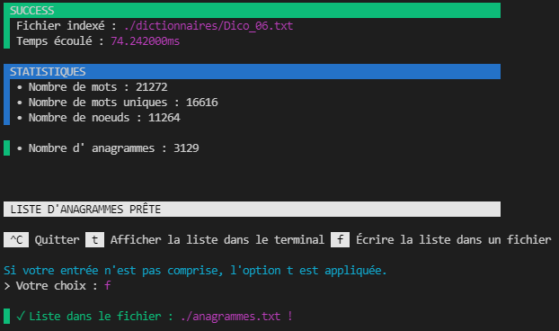

# Programme 3 : Anagrammes
## Description

Ce programme permet de rechercher tous les anagrammes présents dans le dictionnaire dont le chemin est fourni en ligne de commande.
Il affichera le nombre de mots du dictionnaire disposant d’anagrammes ainsi que ces mots et leurs anagrammes triés par nombre d'anagrammes décroissant.

## Fonctionnement
1. Se placer dans le dossier "anagrammes" (exemple : filrouge/app_filrouge/anagrammes)
2. Taper la commande "make"
3. Lancer le programme avec une commande du type suivant :
```bash
$ ./anagrammes.exe <filePath> 
```
| Argument | Description | 
| - | - |
| filePath | Chemin vers un dictionnaire |

4. Plusieurs possibilités s'offrent à l'utilisateur : 
-   taper "Ctrl + C" permet de quitter le programme
-   taper "t" permet d'afficher la liste des anagrammes dans le terminal
-   taper "f" permet d'écrire la liste des anagrammes dans un fichier, nommé "anagrammes.txt", qui sera alors créé et automatiquement ouvert.

__Exemple d'appel :__
```bash
$ ./anagrammes.exe ./dictionnaires/Dico_06.txt
```

__Retour pour cet appel :__
