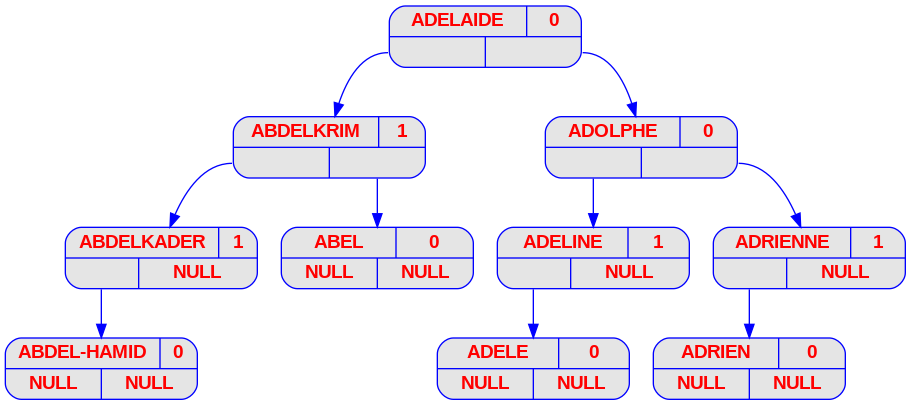

# Programme 1 : Display_avl

## Description
Ce programme affiche graphiquement les étapes de construction d'un arbre AVL (regroupées dans un dossier de fichiers png) contenant les "n" premiers mots d’un fichier dont le chemin est fourni en ligne de commande.
## Fonctionnement
1. Se placer dans le dossier "display_avl" (exemple de chemin suivi : `filrouge/aap_filrouge/display_avl`)
2. Taper la commande "make"
3. Lancer le programme avec une commande du type suivant :
```bash
$ ./display_avl.exe <filePath> <stepCount>
```
| Argument | Description | 
| - | - |
| filePath | Chemin vers la liste des prénoms |
| stepCount | Nombre d'étapes à afficher |

On peut retrouver les fichiers produits dans `output/png/`.

__Exemple d'appel (pour n = 10) :__
```bash
$ ./display_avl.exe Prenoms_V2.txt 10
```
__Retour pour cet appel :__

