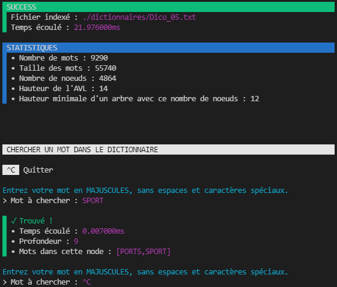

# Programme 2 : Indexation
## Description
Ce programme permet d’indexer les mots d’un dictionnaire, dont le chemin est fourni en ligne de commande, dans un arbre équilibré.

Le programme affichera : 
-   La taille des mots du dictionnaire 
-   Le nombre de mots du dictionnaire
-   La durée de construction de l’arbre en millisecondes
-   Le nombre de noeuds et la hauteur de l’arbre AVL construit
-   La hauteur minimale d’un arbre contenant le même nombre de noeuds


## Fonctionnement
1. Se placer dans le dossier "indexation" (exemple de chemin suivi : `filrouge/app_filrouge/indexation`)
2. Taper la commande "make"
3. Lancer le programme avec une commande du type suivant :
```bash
$ ./indexation.exe <filePath> 
```
| Argument | Description | 
| - | - |
| filePath | Chemin vers un dictionnaire |

4. Taper le mot recherché
5. Continuer à chercher des mots ou bien quitter avec la commande "Ctrl + C"

__Exemple d'appel :__
```bash
$ ./indexation.exe ./dictionnaires/Dico_05.txt 
```

__Retour pour cet appel (en ayant recherché le mot "SPORT") :__

